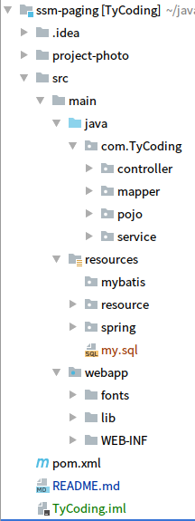
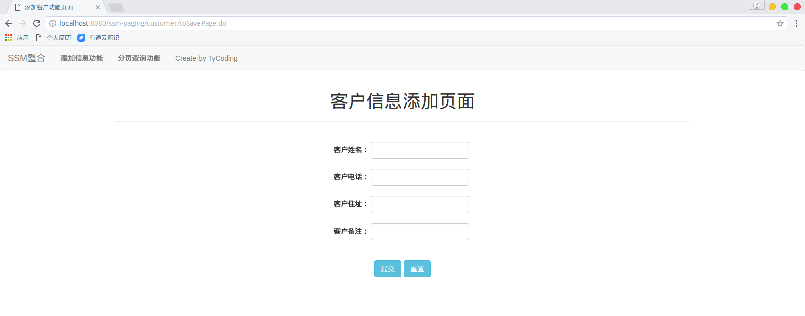
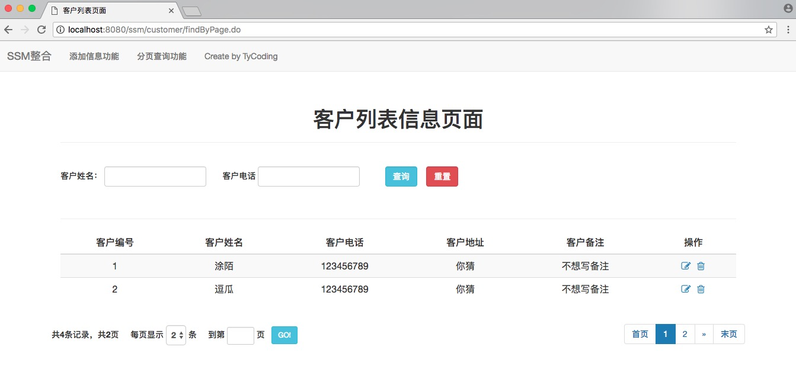

**SSM框架简单的整合并实现分页查询**


前些日子写项目遇到分页查询的功能，并不是很会，查了一些资料，踩了一些坑（然后前台js分页逻辑还不会写），于是在此也写一个较完整的分页查询案例，供自己以后回顾，或是给那些正在学SSM框架（分页查询）的童鞋一个参考，项目实现了对SSM框架的简单整合，并没有使用mybatis的分页插件（有兴趣的可以去了解一下），直接用的Mysql的limit语句实现分页查询。如果是像我一样对前台js分页逻辑不太懂的，就可以仔细看一下我在前台部分写的代码（解释）啦。其他详情请看以下**SSM框架分页查询案例** 。


<!--more-->

**关于项目：**

```
项目框架：后端：spring+mybatis+springmvc; 前端：bootstrap+Font Awesome图标集
测试环境：IDEA+tomcat7+mysql5.7+jdk8+maven
数据库名称：ssm_paging
默认端口：8080
项目首页：localhost:8080/ssm-paging
```

---

#### 首先我们看一下项目的目录结构


***
## 1. 这是一个maven项目，首先导入maven的依赖
```
<dependencys>
    <!-- 单元测试 -->
    <dependency>
      <groupId>junit</groupId>
      <artifactId>junit</artifactId>
      <version>4.11</version>
    </dependency>

    <!-- 1.日志 -->
    <!-- 实现slf4j接口并整合 -->
    <dependency>
      <groupId>ch.qos.logback</groupId>
      <artifactId>logback-classic</artifactId>
      <version>1.1.1</version>
    </dependency>

    <!-- 2.数据库 -->
    <dependency>
      <groupId>mysql</groupId>
      <artifactId>mysql-connector-java</artifactId>
      <version>5.1.37</version>
      <scope>runtime</scope>
    </dependency>
    <dependency>
      <groupId>c3p0</groupId>
      <artifactId>c3p0</artifactId>
      <version>0.9.1.2</version>
    </dependency>

    <!-- DAO: MyBatis -->
    <dependency>
      <groupId>org.mybatis</groupId>
      <artifactId>mybatis</artifactId>
      <version>3.3.0</version>
    </dependency>
    <dependency>
      <groupId>org.mybatis</groupId>
      <artifactId>mybatis-spring</artifactId>
      <version>1.2.3</version>
    </dependency>

    <!-- 3.Servlet web -->
    <dependency>
      <groupId>jstl</groupId>
      <artifactId>jstl</artifactId>
      <version>1.2</version>
    </dependency>
    <dependency>
      <groupId>com.fasterxml.jackson.core</groupId>
      <artifactId>jackson-databind</artifactId>
      <version>2.5.4</version>
    </dependency>
    <dependency>
      <groupId>javax.servlet</groupId>
      <artifactId>javax.servlet-api</artifactId>
      <version>3.1.0</version>
    </dependency>

    <!-- 4.Spring -->
    <!-- 1)Spring核心 -->
    <dependency>
      <groupId>org.springframework</groupId>
      <artifactId>spring-core</artifactId>
      <version>4.1.7.RELEASE</version>
    </dependency>
    <dependency>
      <groupId>org.springframework</groupId>
      <artifactId>spring-beans</artifactId>
      <version>4.1.7.RELEASE</version>
    </dependency>
    <dependency>
      <groupId>org.springframework</groupId>
      <artifactId>spring-context</artifactId>
      <version>4.1.7.RELEASE</version>
    </dependency>
    <!-- 2)Spring DAO层 -->
    <dependency>
      <groupId>org.springframework</groupId>
      <artifactId>spring-jdbc</artifactId>
      <version>4.1.7.RELEASE</version>
    </dependency>
    <dependency>
      <groupId>org.springframework</groupId>
      <artifactId>spring-tx</artifactId>
      <version>4.1.7.RELEASE</version>
    </dependency>
    <!-- 3)Spring web -->
    <dependency>
      <groupId>org.springframework</groupId>
      <artifactId>spring-web</artifactId>
      <version>4.1.7.RELEASE</version>
    </dependency>
    <dependency>
      <groupId>org.springframework</groupId>
      <artifactId>spring-webmvc</artifactId>
      <version>4.1.7.RELEASE</version>
    </dependency>
    <!-- 4)Spring test -->
    <dependency>
      <groupId>org.springframework</groupId>
      <artifactId>spring-test</artifactId>
      <version>4.1.7.RELEASE</version>
    </dependency>
  </dependencies>
```
* 如果你使用的是IDEA，那么还需要在pom.xml中写入以下配置，以便IDEA能够检测到非resources目录下的配置文件
```
<build>
    <finalName>TyCoding</finalName>
    <resources>
      <resource>
        <directory>${basedir}/src/main/java</directory>
        <includes>
          <include>**/*.properties</include>
          <include>**/*.xml</include>
        </includes>
      </resource>
      <resource>
        <directory>${basedir}/src/main/resources</directory>
      </resource>
    </resources>
  </build>
```

## 2. XML配置文件
#### spring-dao.xml
```
<?xml version="1.0" encoding="UTF-8"?>
<beans xmlns="http://www.springframework.org/schema/beans"
       xmlns:xsi="http://www.w3.org/2001/XMLSchema-instance"
       xmlns:context="http://www.springframework.org/schema/context"
       xsi:schemaLocation="http://www.springframework.org/schema/beans
    http://www.springframework.org/schema/beans/spring-beans.xsd
    http://www.springframework.org/schema/context
    http://www.springframework.org/schema/context/spring-context.xsd">

    <!-- 配置注解扫描 -->
    <context:component-scan base-package="com.TyCoding.service"/>

    <!-- 加载配置文件 -->
    <context:property-placeholder location="classpath:resource/jdbc.properties"/>

    <!-- 数据库连接池 -->
    <bean id="dataSource" class="com.mchange.v2.c3p0.ComboPooledDataSource">
        <!-- 配置连接池属性 -->
        <property name="driverClass" value="${jdbc.driver}"/>
        <property name="jdbcUrl" value="${jdbc.url}"/>
        <property name="user" value="${jdbc.username}"/>
        <property name="password" value="${jdbc.password}"/>

        <!-- c3p0连接池的私有属性 -->
        <property name="maxPoolSize" value="30" />
        <property name="minPoolSize" value="10" />
        <!-- 关闭连接后不自动commit -->
        <property name="autoCommitOnClose" value="false" />
        <!-- 获取连接超时时间 -->
        <property name="checkoutTimeout" value="10000" />
        <!-- 当获取连接失败重试次数 -->
        <property name="acquireRetryAttempts" value="2" />
    </bean>

    <!-- 配置SqlSessionFactory对象 -->
    <bean id="sqlSessionFactory" class="org.mybatis.spring.SqlSessionFactoryBean">
        <!-- 注入数据库连接池 -->
        <property name="dataSource" ref="dataSource"/>
        <!-- 扫描pojo包，使用别名配置(在mybatis中可以使用别名，即pojo的名称) -->
        <property name="typeAliasesPackage" value="com.TyCoding.pojo"/>
        <!-- 扫描mapper的配置文件 -->
        <property name="mapperLocations" value="classpath:com/TyCoding/mapper/*.xml"/>
    </bean>

    <!-- 使用mybatis的接口代理开发模式(必须保证接口和对应的mybatis的xml名称相同，且在一个文件夹内) -->
    <bean class="org.mybatis.spring.mapper.MapperScannerConfigurer">
        <property name="basePackage" value="com.TyCoding.mapper"/>
        <property name="sqlSessionFactoryBeanName" value="sqlSessionFactory"/>
    </bean>
</beans>
```

#### spring.mvc.xml
```
<?xml version="1.0" encoding="UTF-8"?>
<beans xmlns="http://www.springframework.org/schema/beans"
       xmlns:xsi="http://www.w3.org/2001/XMLSchema-instance"
       xmlns:aop="http://www.springframework.org/schema/aop"
       xmlns:tx="http://www.springframework.org/schema/tx"
       xmlns:mvc="http://www.springframework.org/schema/mvc"
       xmlns:context="http://www.springframework.org/schema/context"
       xsi:schemaLocation="http://www.springframework.org/schema/beans
        http://www.springframework.org/schema/beans/spring-beans.xsd
        http://www.springframework.org/schema/aop
         http://www.springframework.org/schema/aop/spring-aop.xsd
         http://www.springframework.org/schema/context
         http://www.springframework.org/schema/context/spring-context.xsd
         http://www.springframework.org/schema/tx
         http://www.springframework.org/schema/context/spring-tx.xsd
         http://www.springframework.org/schema/mvc
         http://www.springframework.org/schema/mvc/spring-mvc.xsd">

    <!-- 开启注解扫描 -->
    <context:component-scan base-package="com.TyCoding.controller"/>

    <!-- 配置springmvc的驱动，并开启了对json数据格式的支持 -->
    <mvc:annotation-driven/>

    <!-- 配置springmvc的视图解析器 -->
    <bean class="org.springframework.web.servlet.view.InternalResourceViewResolver">
        <property name="prefix" value="/WEB-INF/"/>
        <property name="suffix" value=".jsp"/>
    </bean>
</beans>
```
#### jdbc.properties(数据库链接配置)
```
jdbc.driver=com.mysql.jdbc.Driver
jdbc.url=jdbc:mysql://localhost:3306/ssm_paging?useUnicode=true&characterEncoding=UTF-8
jdbc.username=用户名
jdbc.password=密码
```
* 这里需要注意的是：在jdbc.url属性中对应的数据库链接要规定字符编码为UTF-8，因为我遇到的情况就是我在创建数据库和表的时候都指定了字符集，但是前台保存进来的数据还是会乱码，就是项目在链接数据库时没有指定字符编码的原因
#### web.xml
```
<?xml version="1.0" encoding="UTF-8"?>
<web-app xmlns:xsi="http://www.w3.org/2001/XMLSchema-instance" xmlns="http://java.sun.com/xml/ns/javaee"
         xsi:schemaLocation="http://java.sun.com/xml/ns/javaee http://java.sun.com/xml/ns/javaee/web-app_2_5.xsd"
         id="WebApp_ID" version="2.5">

    <display-name>Archetype Created Web Application</display-name>
    <welcome-file-list>
        <welcome-file>/WEB-INF/index.jsp</welcome-file>
    </welcome-file-list>

    <!-- 配置spring的字符编码过滤器 -->
    <filter>
        <filter-name>CharacterEncoding</filter-name>
        <filter-class>org.springframework.web.filter.CharacterEncodingFilter</filter-class>
        <init-param>
            <param-name>encoding</param-name>
            <param-value>utf-8</param-value>
        </init-param>
    </filter>
    <filter-mapping>
        <filter-name>CharacterEncoding</filter-name>
        <url-pattern>/*</url-pattern>
    </filter-mapping>

    <!-- 加载spring容器 -->
    <context-param>
        <param-name>contextConfigLocation</param-name>
        <param-value>classpath:spring/spring-*.xml</param-value>
    </context-param>
    <listener>
        <listener-class>org.springframework.web.context.ContextLoaderListener</listener-class>
    </listener>

    <!-- 配置springmvc的核心控制器 -->
    <servlet>
        <servlet-name>dispatcherServlet</servlet-name>
        <servlet-class>org.springframework.web.servlet.DispatcherServlet</servlet-class>
        <init-param>
            <param-name>contextConfigLocation</param-name>
            <param-value>classpath:spring/springmvc.xml</param-value>
        </init-param>
    </servlet>
    <servlet-mapping>
        <servlet-name>dispatcherServlet</servlet-name>
        <url-pattern>*.do</url-pattern>
    </servlet-mapping>
</web-app>
```
* 这里需要注意的是springmvc的字符编码过滤器需要放在所有过滤器的前面

## 2. 创建javaBean实体类

**1. User**
```
//用户id
private int uid;
//用户登录名
private String username;
//用户密码
private String password;
...
getter/setter方法省略
```

**2. Customer**
```
//客户的id
private int c_id;
//客户的姓名
private String c_name;
//客户的电话
private String c_telephone;
//客户的住址
private String c_address;
//客户备注
private String c_remark;
...
getter/setter方法省略
```

**3. PageBean**
```
public class PageBean<T> implements Serializable {
    //当前页
    private int pageCode;

    //总页数=总条数/每页显示的条数
    private int totalPage;

    //总记录数
    private int totalCount;

    //每页显示的记录条数
    private int pageSize;

    //每页显示的数据
    private List<T> beanList;
}
```
* 这里用了自定义泛型类就是实现由后台决定这个分页Bean要去封装那种类型的数据，我们调用时传入类型就会封装什么类型数据

## 3. 创建表结构
```
create database ssm_paging character set utf8;
use ssm_paging;

create table user(
    uid int primary key auto_increment,
    username varchar(100),
    password varchar(100)
) default charset = utf8;

create table customer(
    c_id int primary key auto_increment,
    c_name varchar(100),
    c_telephone varchar(100),
    c_address varchar(100),
    c_remark varchar(100)
) default charset = utf8;

# 插入数据
insert into user values(1,'admin','admin');

insert into customer values(1,'涂陌','123456789','你猜','不想写备注');
insert into customer values(2,'逗瓜','123456789','你猜','不想写备注');
insert into customer values(3,'愤青','123456789','你猜','不想写备注');
insert into customer values(4,'咸鱼','123456789','你猜','不想写备注');
insert into customer values(5,'小白','123456789','你猜','不想写备注');
insert into customer values(6,'菜鸡','123456789','你猜','不想写备注');
```

## 4. controller层
```
package com.TyCoding.controller;

import com.TyCoding.pojo.Customer;
import com.TyCoding.service.CustomerService;
import org.springframework.beans.factory.annotation.Autowired;
import org.springframework.stereotype.Controller;
import org.springframework.ui.Model;
import org.springframework.web.bind.annotation.RequestBody;
import org.springframework.web.bind.annotation.RequestMapping;
import org.springframework.web.bind.annotation.RequestParam;
import org.springframework.web.bind.annotation.ResponseBody;

import javax.servlet.http.HttpServletRequest;
import java.util.HashMap;
import java.util.Map;

/**
 * 这是客户管理的Controller层
 */
@Controller
@RequestMapping(value = "/customer")
public class CustomerController {

    /**
     * 注入service层
     */
    @Autowired
    private CustomerService customerService;

    /**
     * 跳转到添加客户功能页面
     */
    @RequestMapping("/toSavePage")
    public String toSavePage(Model model) {
        // 先去后台查询数据库中最后一个主键值，默认设置下一个主键值是新插入数据的id
        int id = customerService.findLastId();
        System.out.println("后台查询到的id值：" + id);
        // 将查询到的值设置到Model中
        model.addAttribute("newId", id + 1);
        return "page/save";
    }

    /**
     * 跳转到客户列表页面
     */
    @RequestMapping(value = "/toListPage")
    public String toListPage(Model model) {
        return "redirect:findByPage.do";
    }

    /**
     * 客户信息保存的方法
     */
    @RequestMapping(value = "/save")
    public String save(Customer customer, Model model) {
        customerService.save(customer);
        model.addAttribute("message", "保存客户信息系成功");
        return "page/info";
    }

    /**
     * 客户信息列表（分页查询功能）
     */
    @RequestMapping(value="/findByPage")
    public String findByPage(@RequestParam(value="pageCode",defaultValue = "1",required = false)int pageCode,
                             @RequestParam(value="pageSize",defaultValue = "2",required = false)int pageSize,
                             HttpServletRequest request,
                             Model model){
        // 封装分页数据
        String c_name = request.getParameter("c_name");
        String c_telephone = request.getParameter("c_telephone");
        Map<String,Object> conMap = new HashMap<String,Object>();
        conMap.put("c_name",c_name);
        conMap.put("c_telephone",c_telephone);

        // 回显数据
        model.addAttribute("page",customerService.findByPage(pageCode,pageSize,conMap));
        return "page/list";
    }

    /**
     * 客户信息删除的方法
     */
    @RequestMapping(value="/delete")
    public String delete(@RequestParam int c_id,Model model){
        int rows = customerService.delete(c_id);
        if(rows > 0){
            model.addAttribute("message","删除客户信息成功");
            return "page/info";
        }else{
            model.addAttribute("message","删除客户信息失败");
            return "page/info";
        }
    }

    /**
     * 根据id查询客户信息方法
     */
    @ResponseBody
    @RequestMapping(value="/findById")
    public Customer findById(@RequestBody Customer customer){
        Customer customer_info = customerService.findById(customer.getC_id());
        if(customer_info != null){
            return customer_info;
        }else{
            return null;
        }
    }

    /**
     * 更新客户信息的方法
     */
    @RequestMapping(value="/update")
    public String update(Customer customer,Model model){
        int rows = customerService.update(customer);
        if(rows > 0){
            model.addAttribute("message","更新客户信息成功");
            return "page/info";
        }else{
            model.addAttribute("message","更新客户信息失败");
            return "page/info";
        }
    }
}
```
* 这里解释一下分页查询的方法吧，其他操作相对简单一下
```
1. 这里我们接收了前台的两个数据：pageCode(当前页)、pageSize(每页显示几条记录),因为当前页和每页显示几条数据都应该是用户决定的
   我们用@RequestParam注解自带的属性，设置了pageCode和pageSzie的默认值
2. @RequestParam属性是用来接收前端传入的参数的，其中"required"属性决定了这个参数前端是否必须传入，默认是true(必须),
   因为如果接收一个int类型的参数，这个@RequestParam属性会将其赋值为null,显然这样会直接报错，所以我们设置了false
3. 条件查询，我们先从request请求体中获取到查询数据的name值，将数据封装到Map集合中（通常参数较多一般用Map进行封装传值）
```

## 5. service层
```
package com.TyCoding.service.impl;

import com.TyCoding.mapper.CustomerMapper;
import com.TyCoding.pojo.Customer;
import com.TyCoding.pojo.PageBean;
import com.TyCoding.service.CustomerService;
import org.springframework.beans.factory.annotation.Autowired;
import org.springframework.stereotype.Service;

import java.util.HashMap;
import java.util.List;
import java.util.Map;

/**
 * 客户的service层
 */
@Service
public class CustomerServiceImpl implements CustomerService {

    /**
     * 注入
     */
    @Autowired
    private CustomerMapper customerMapper;

    /**
     * 客户信息保存的方法
     */
    public void save(Customer customer) {
        customerMapper.save(customer);
    }

    /**
     * 查询最后customer表中最后一个主键值，那么下一个默认就是新增客户的主键值
     */
    public int findLastId() {
        return customerMapper.findLastId();
    }

    /**
     * 分页查询的方法
     */
    public PageBean<Customer> findByPage(int pageCode, int pageSize, Map<String, Object> conMap) {
        HashMap<String,Object> map = new HashMap<String,Object>();
        PageBean<Customer> pageBean = new PageBean<Customer>();

        //封装当前页
        pageBean.setPageCode(pageCode);
        pageBean.setPageSize(pageSize);

        // 封装总记录数（从数据库中查询）
        int totalCount = customerMapper.selectCount();
        pageBean.setTotalCount(totalCount);

        //封装总页数
        double tc = totalCount;
        Double num = Math.ceil(tc / pageSize);
        pageBean.setTotalPage(num.intValue());

        // 设置limit分页查询的起始位置和终止位置
        map.put("start",(pageCode - 1) * pageSize);
        map.put("size",pageBean.getPageSize());

        //封装每页显示的数据
        List<Customer> list = customerMapper.findByPage(map);
        pageBean.setBeanList(list);

        // 分页查询功能也要封装显示起始页和终止页
        conMap.put("start",(pageCode - 1) * pageSize);
        conMap.put("size",pageBean.getPageSize());

        // 封装
        List<Customer> listCondition = customerMapper.findCondition(conMap);
        pageBean.setBeanList(listCondition);

        return pageBean;
    }

    /**
     * 根据id删除信息的方法
     */
    public int delete(int c_id) {
        return customerMapper.delete(c_id);
    }

    /**
     * 根据客户id查询客户信息的方法
     */
    public Customer findById(int c_id) {
        return customerMapper.findById(c_id);
    }

    /**
     * 更新客户信息的方法
     */
    public int update(Customer customer) {
        return customerMapper.update(customer);
    }
}
```
* 同样解释一下分页查询的方法
```
1. 首先我们接收到了前台传来的pageCode和pageSize两个参数，在这里就要封装到pageBean中
2. 计算总页数：总页数 = 总记录数 / 每页显示的记录条数
   这里用到的ceil()方法：返回大于或登录参数的最小double值，并等于数学整数
   如double a = 5;double b = 3;ceil(a/b) = 2.0
   最后用Double类的intValue()方法返回此Double值作为int类型的值
3. mysql为分页查询提供了limit方法，limit a,b就是读取第a条到第b条的所有记录
   设置start为"(当前页-1)*此时每页显示的记录数"
   设置size为"我们在pageBean中封装的每页显示几条记录数"
   例如：我们目前页面每页显示2条数据，点击下一页，则显示的数据就是第3-5条   
```

## 6. Mapper.xml
* 注意：这里使用了mybatis的mapper接口实现方式，有几个注意事项：
    1. mapper.xml文件名称必须和接口名称相同
    2. Mapper 接口方法名和 UserMapper.xml 中定义的每个 sql 的 id 同名。
    3. Mapper 接口方法的输入参数类型和 UserMapper.xml 中定义的 sql 的parameterType 类型相同。
    4. Mapper 接口的返回类型和 UserMapper.xml 中定义的 sql 的 resultType 类型相同
```
<?xml version="1.0" encoding="UTF-8"?>
<!DOCTYPE mapper PUBLIC "-//mybatis.org//DTD Mapper 3.0//EN"
        "http://mybatis.org/dtd/mybatis-3-mapper.dtd">

<mapper namespace="com.TyCoding.mapper.CustomerMapper">

    <resultMap id="BaseResultMap" type="com.TyCoding.pojo.Customer">
        <id column="c_id" property="c_id" jdbcType="INTEGER"/>
        <result column="c_name" property="c_name" jdbcType="VARCHAR"/>
        <result column="c_telephone" property="c_telephone" jdbcType="VARCHAR"/>
        <result column="c_address" property="c_address" jdbcType="VARCHAR"/>
        <result column="c_remark" property="c_remark" jdbcType="VARCHAR"/>
    </resultMap>

    <!-- 客户信息保存的方法 -->
    <insert id="save" parameterType="com.TyCoding.pojo.Customer">
        insert into
        customer(
          c_id,
          c_name,
          c_telephone,
          c_address,
          c_remark)
        values(
          #{c_id},
          #{c_name},
          #{c_telephone},
          #{c_address},
          #{c_remark}
        );
    </insert>

    <!-- 查询customer表中最后一个字段的的主键值 -->
    <select id="findLastId" resultType="int">
        select c_id from customer order by c_id desc limit 1;
    </select>

    <!-- 查询总的记录数 -->
    <select id="selectCount" resultType="int">
        select count(*) from customer;
    </select>

    <!-- 分页查询 -->
    <select id="findByPage" parameterType="Map" resultMap="BaseResultMap">
        select * from customer
        <if test="start != null and size != null">
            limit #{start},#{size}
        </if>
    </select>

    <!-- 多条件查询 -->
    <select id="findCondition" parameterType="Map" resultMap="BaseResultMap">
        select * from customer where 1 = 1
        <if test="c_name != null and c_name != ''">
            and c_name like concat('%', #{c_name}, '%')
        </if>
        <if test="c_telephone != null and c_telephone != ''">
            and c_telephone like concat('%', #{c_telephone}, '%')
        </if>
        <if test="start != null and size != null">
            limit #{start},#{size}
        </if>
    </select>

    <!-- 根据id删除信息的方法 -->
    <delete id="delete" parameterType="int">
        delete from customer where c_id = #{c_id}
    </delete>

    <!-- 根据客户id查询客户信息的方法 -->
    <select id="findById" parameterType="int" resultType="Customer">
        select * from customer where c_id = #{c_id}
    </select>

    <!-- 更新客户信息的方法 -->
    <update id="update" parameterType="Customer">
        update customer set
            c_id = #{c_id},
            c_name = #{c_name},
            c_telephone = #{c_telephone},
            c_address = #{c_address},
            c_remark = #{c_remark}
        where c_id = #{c_id}
    </update>
</mapper>
```
* 注意事项：
```
1. findByPage方法是用来分页显示数据的，我们传进来的数据是Map集合，定义了parameType="Map"
   resultMap实现了将查询到的复杂的数据映射到一个结果集中
2. findCondition方法是用来分页显示条件查询到的数据的，
   注意where 1 = 1主要是用来避免以下动态sql中的条件都不满足的情况时，where后就没数据了，这样显然报错，加上1=1就避免了这种情况
```
**7. 前端部分**

**前端 JS的分页逻辑算法**

**分析**

```text
百度分页算法（每页显示10个页码）：
	当点击页码7之后的页码，最前端的页码依次减少
		[0] [1] [2] [3] [4] [5] [6] [7] [8] [9] [10]
		点击[7]
		[1] [2] [3] [4] [5] [6] [7] [8] [9] [10] [11]
算法：
	若 总页数 <= 10		则begin=1			  end=总页数
	若 总页数 > 10		则begin=当前页-5	  	end=当前页+4
		头溢出: 若begin < 1		 则begin=1	   end=10
		尾溢出: 若begin > 当前页  则brgin=end-9	 end=总页数	
		
我对词项目每页显示5个页码：
	若 总页数 <= 5		则begin=1			  end=总页数
	若 总页数 >  5		则begin=当前页-1	  	end=当前页+3
		头溢出: 若begin < 1		 则begin=1	   end=5
		尾溢出: 若begin > 当前页  则brgin=end-4	 end=总页数
```

**前端分页代码**

```html
<form class="listForm" name="listForm" method="post" action="<%=basePath%>/cutton_findByPage.action">
  <div class="row">
    <div class="form-inline">
      <label style="font-size:14px;margin-top:22px;">
        <strong>共<b>${page.totalCount}</b>条记录，共<b>${page.totalPage}</b>页</strong>
        &nbsp;
        &nbsp;
        <strong>每页显示</strong>
        <select class="form-control" name="pageSize">
          <option value="4"
                  <c:if test="${page.pageSize == 4}">selected</c:if> >4
        </option>
      <option value="6"
              <c:if test="${page.pageSize == 6}">selected</c:if> >6
    </option>
  <option value="8"
          <c:if test="${page.pageSize == 8}">selected</c:if> >8
</option>
<option value="10"
        <c:if test="${page.pageSize == 10}">selected</c:if> >10
</option>
</select>
<strong>条</strong>
&nbsp;
&nbsp;
<strong>到第</strong>&nbsp;<input type="text" size="3" id="page" name="pageCode"
                                class="form-control input-sm"
                                style="width:11%"/>&nbsp;<strong>页</strong>
&nbsp;
<button type="submit" class="btn btn-sm btn-info">GO!</button>
</label>
<ul class="pagination" style="float:right;">
  <li>
    <a href="<%=basePath%>/cutton_findByPage.action?pageCode=1"><strong>首页</strong></a>
  </li>
  <li>
    <c:if test="${page.pageCode > 2}">
      <a href="<%=basePath%>/cutton_findByPage.action?pageCode=${page.pageCode - 1}">&laquo;</a>
    </c:if>
  </li>

  <!-- 写关于分页页码的逻辑 -->
  <c:choose>
    <c:when test="${page.totalPage <= 5}">
      <c:set var="begin" value="1"/>
      <c:set var="end" value="${page.totalPage}"/>
    </c:when>
    <c:otherwise>
      <c:set var="begin" value="${page.pageCode - 1}"/>
      <c:set var="end" value="${page.pageCode + 3}"/>

      <!-- 头溢出 -->
      <c:if test="${begin < 1}">
        <c:set var="begin" value="1"/>
        <c:set var="end" value="5"/>
      </c:if>

      <!-- 尾溢出 -->
      <c:if test="${end > page.totalPage}">
        <c:set var="begin" value="${page.totalPage -4}"/>
        <c:set var="end" value="${page.totalPage}"/>
      </c:if>
    </c:otherwise>
  </c:choose>

  <!-- 显示页码 -->
  <c:forEach var="i" begin="${begin}" end="${end}">
    <!-- 判断是否是当前页,这里用if判断实现是否被点击的页码呈现active样式 -->
    <c:if test="${i == page.pageCode}">
      <li class="active"><a href="javascript:void(0);">${i}</a></li>
    </c:if>
    <c:if test="${i != page.pageCode}">
      <li>
        <a href="<%=basePath%>/cutton_findByPage.action?pageCode=${i}">${i}</a>
      </li>
    </c:if>
  </c:forEach>
  <li>
    <c:if test="${page.pageCode < page.totalPage}">
      <a href="<%=basePath%>/cutton_findByPage.action?pageCode=${page.pageCode + 1}">&raquo;</a>
    </c:if>
  </li>
  <li>
    <a href="<%=basePath%>/cutton_findByPage.action?pageCode=${page.totalPage}"><strong>末页</strong></a>
  </li>
</ul>
</div>
</div>
</form>
```

****

#### 项目运行截图







<br/>
交流

如果大家有兴趣，欢迎大家加入我的Java交流群：671017003 ，一起交流学习Java技术。博主目前一直在自学JAVA中，技术有限，如果可以，会尽力给大家提供一些帮助，或是一些学习方法，当然群里的大佬都会积极给新手答疑的。所以，别犹豫，快来加入我们吧！  

<br/>

联系

If you have some questions after you see this article, you can contact me or you can find some info by clicking these links.

- Blog@TyCoding's blog
- GitHub@TyCoding
- ZhiHu@TyCoding
