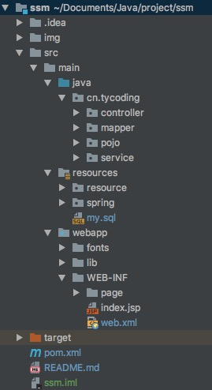
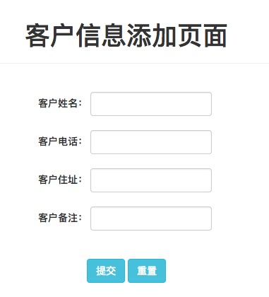
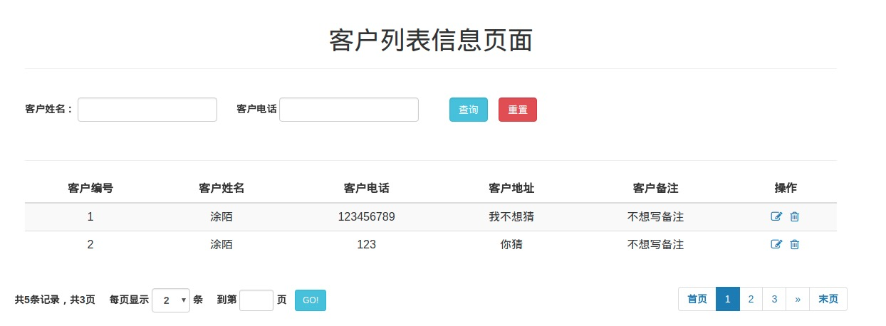
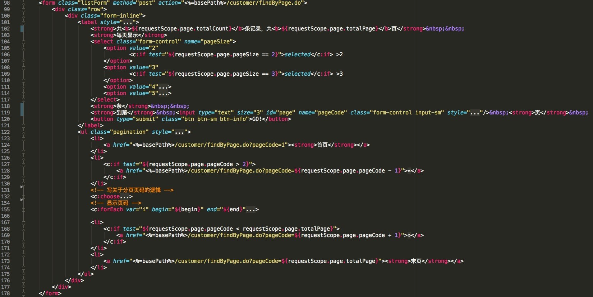
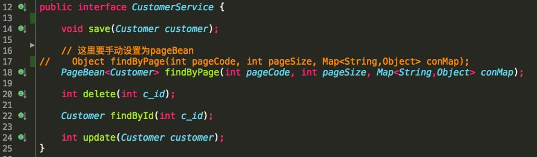
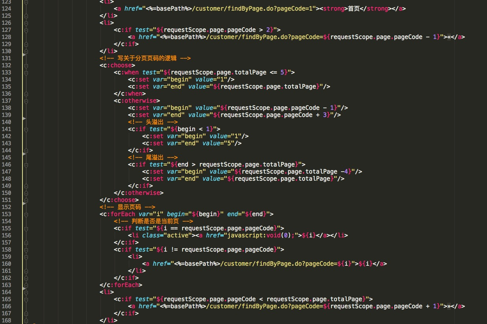
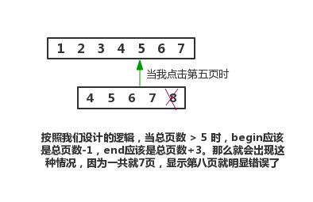

# 手把手教你入门SSM框架开发

关于SSM框架环境搭建，请点击这里前往我的博客：[SSM框架整合之环境搭建](http://tycoding.cn/2018/06/04/ssm/)
由于本项目采用了maven，关于IDEA搭建maven项目过程请点击这里前往我的博客：[maven起步](http://tycoding.cn/2018/06/01/maven/)

# 关于项目
## 项目环境
```
项目框架：后端：spring+mybatis+springmvc; 前端：bootstrap+Font Awesome图标集
测试环境：IDEA + tomcat8 + mysql5.7 + jdk8 + maven
数据库名称：ssm
```
## 项目功能
```
1. 实现用户登录功能
2. 实现客户信息的增删改查功能
3. 实现分页查询功能
```
## 项目结构



**备注**
如上是一个标准的maven项目，我们来解释一下各个目录：

> **img:** 放了一些README.md文档所需要得图片，没有实际意义。
>
> **controller:** web层，存放springmvc的相关控制器类。
>
> **mapper:** 存放接口和映射文件。因为本项目采用了mybatis的接口开发，所以需要将接口和映射文件放在同一目录下，并且名称相同。
>
> **pojo:** 存放Java的实体类
>
> **service:** 业务层，用于存放一些业务层代码。

不要奇怪为什么没有出现Dao层，因为本项目相对简单，并没有多复杂的逻辑，所以也就必要再写一个Dao层进行扩展。

> **resources:** 是maven项目存放配置文件的根目录，在本例中包含两个子文件夹:`resource`、`spring`。前者是存放一些如`logback.properties`的配置文件；后者是存放spring的配置文件（spring和springmvc）。
>
> **my.sql:** 存放了关于项目数据库创建和表创建的SQL语句。
>
> **fonts:** 存放一些字体的配置文件。为了页面的美感，我们采用了*Awesome*图标集。
>
> **lib:** 包含了项目中用到的一些前端类库。
>
> **page:** 包含所有前端页面。

## 整合思路
继上一篇博文：[Spring MVC起步](http://tycoding.cn/2018/05/29/Spring-5/)其实我们已经了解了如何整合Spring和Spring MVC框架。那么，接下来我们就需要了解如何在此基础上整合Mybatis框架。
首先须知Mybatis框架是一个持久层框架，而Spring MVC是WEB层框架，Spring框架则充当着业务层的角色。那么将三者联系起来正好组成了`web--service--dao`的三层架构体系。那么整合思路就如下所示了：
    1. 整合dao(即mapper)，实现Mybatis和Spring的整合
    2. 整合service，由Spring管理service接口，在service中可以调用dao（mapper）
    3. 整合web（controller），实现Spring MVC和Spring的整合，在controller中调用service


# 需求实现
## 1. 实现用户登录功能
### 1.1 创建表结构
SQL语句请查看GitHub中resources目录下的.sql文件
除了创建表，我们同样要创建`pojo`对象，并提供属性setter和getter方法。（注意尽量保持`pojo`属性参数和表字段名称对应相等）

### 1.2 编写Controller层
```java
@RequestMapping(value = "/login")
public String login(@RequestParam String username,@RequestParam String password, Model model) {
    User user = userService.login(username);
    if (user != null) {
        if (user.getPassword().equals(password)) {
            //登录成功
            return "page/page";
        } else {
            model.addAttribute("message", "登录失败");
            return "page/loginInfo";
        }
    } else {
        model.addAttribute("message", "你输入的用户名或密码有误");
        return "page/loginInfo";
    }
}
```
`@RequestMapping`标注`login()`方法有两个作用（前提是必须在XML中开启注解扫描`<context:component-scan/>`）：1.表示该方法是请求处理方法；2.指明了该方法的请求路径。`@RequestMapping`可以标记类或方法，分别表示了不同层级的请求路径。例如当前的`login()`方法的请求路径应为：`localhost:8080/xxx/login.do`
对于请求体中包含多个参数的情况，我们尽量用`@RequestParam`标记参数，以免出现未知错误（但这不是必须的）。
用户登录，我们首先获取到用户登录的用户名`username`和密码`password`，然后根据用户名查询并返回，根据此用户名查询到的密码与登录的密码进行`equals`，如果相等就登录成功。（当然我们要判断根据`username`查询后的返回值是否为null，不做判断会产生空指针问题，如果一个空值和另一个值相比显然会报错）。
如果登录成功，将返回到`page/page.jsp`页面（这是根据我们在`springmvc.xml`下配置的视图解析器`InternalResourceViewResolver`决定的）;如果登录失败将返回到`page/loginInfo.jsp`页面。

### 1.3 编写Mapper.xml
```xml
<select id="login" parameterType="String" resultType="User">
    select * from user where username = #{username}
</select>
```
我们使用了Mybatis的接口代理开发模式（保证接口和配置文件在同一目录下且名称相同），直接在`Mapper.xml`中编写原生sql语句，即可进行与数据库间的交互。
`id`指明是哪个方法调用这个sql；`parameterType`指定了接口传递的参数类型(我们根据用户名查询所以是String类型)；`resultType`指定该查询语句返回值的数据类型（因为我们已经在配置文件启用了别名配置`typeAliases`，所以这里直接指定pojo对象类名即可；若没有启动别名配置，就必须写类的全限定名）。使用`#{}`会将传递的参数值会自动添加`""`；注意`#{}`和`${}`区分，后者则是直接拼接传递进来的字符串，而不会添加任何符号，且前者能避免sql注入。


## 2. 实现客户信息的添加

所谓添加客户信息，就是将JSP中提交的表单数据持久化到数据库中。
### 2.1 创建表结构
建表SQL请看github项目中的resources目录下的.sql文件
同样我们还要创建对应的`pojo`，并提供getter和setter方法。（尽量保持`pojo`中的元素属性名称和表中字段名称相同）。
### 2.2 编写Controller层
```java
@RequestMapping(value = "/save")
public String save(Customer customer, Model model) {
    customerService.save(customer);
    model.addAttribute("message", "保存客户信息系成功");
    return "page/info";
}
```



当点击了提交按钮，表单中的所有数据都应该被持久化到数据库中，而要知道表单中的参数有很多，我们直接在请求映射方法的参数列表中写参数显然是不可取的，那么我们如果写一个pojo对象，Spring就会根据这个pojo对象中的属性和JSP表单中的参数进行对应，如果完全对应那么请求方法会正常执行，一但有某个参数不对应，那么就会报错。（注意我们表单中并不需要指定`id`主键值，因为设计表时已经指定了该`id`主键为自增长，即使不指定值，`id`依然会自增，你指定了却可能会产生错误，因为到保证每次的`id`值都是递增的）。当数据持久化成功，就使用Spring的`Model`对象在域对象中设置一个名为`message`的值。最后再返回到视图层。

### 2.3 编写Mapper.xml
```xml
<insert id="save" parameterType="Customer">
        insert into
        customer(
          c_name,
          c_telephone,
          c_address,
          c_remark)
        values(
          #{c_name},
          #{c_telephone},
          #{c_address},
          #{c_remark}
        );
</insert>
```
如上这仍然是普通的SQL语句，注意`parameterType`如上我们设置为`Customer`其实代表的是`cn.tycoding.pojo.Customer`这个对象，因为我们已经在`beans.xml`中启用了mybatis的别名配置。SQL插入语句中不需要指定`id`这个字段，原因是我们已经配置了`id`为自增主键


## 3. 实现客户信息的删除功能

### 3.1 编写Controller层
```java
@RequestMapping(value="/delete")
public String delete(@RequestParam int c_id,Model model){
    if(customerService.delete(c_id) > 0){
        model.addAttribute("message","删除客户信息成功");
        return "page/info";
    }else{
        model.addAttribute("message","删除客户信息失败");
        return "page/info";
    }
}
```
删除功能只需要根据点击删除按钮时获取到的`id`值，在SQL的`delete`语句中`where`这个id值，即可以实现根据id删除客户信息。
### 3.2 编写Mapper.xml
```xml
<delete id="delete" parameterType="int">
    delete from customer where c_id = #{c_id}
</delete>
```
如此，还是一个再普通不过的SQL语句，既可以实现根据id删除的功能。


## 4. 更新客户信息

更新客户信息需要我们实现两个功能：1.再点击*编辑*按钮时(我们在按钮设置了`onclick="return edit(${xx.id};"`)，如此我们用js监听这个事件，点击了按钮，js获取到id，请求后台根据这个id值查询数据库中的数据。那么我们先看一下js部分吧：
```javascript
function edit(id){
  $.ajax({
    url: 'xxx/findById.do',
    type: 'POST',
    dataType: 'json',
    contentType: 'application/json;charset=UTF-8',
    data: JSON.stringify({id: id}),
    success: function(result){
      $("#username").val(result.username);
      $("#password").val(result.password);
      //继续讲查询到的字段依次进行赋值...
    }::
  });
}
```
以上实际是一个ajax请求json格式数据：1.`type`指定请求类型；2.`dataType`指定了服务器返回数据格式类型；3.`contentType`指定发送给服务器的数据格式，默认是`application/x-www-form-urlencoded`会使此时的`data`参数为JSON对象，而设置为`application/json`后此时的`data`参数就是json字符串了，同样使用`stringify()`也是将`data`参数转换成json字符串。
### 4.1 编写Controller层
```java
@ResponseBody
@RequestMapping(value="/findById")
public Customer findById(@RequestBody Customer customer){
    Customer customer_info = customerService.findById(customer.getC_id());
    if(customer_info != null){
        return customer_info;
    }else{
        return null;
    }
}
```
`@RequestBody`读取http请求内容，并将数据绑定在映射方法的参数上；`@ResponseBody`将映射需要返回的参数转换成指定的数据格式，而由于我们在ajax请求中指定`dataType`为`json`，那么`@ReqponseBody`将会返回json格式数据。
当ajax请求了这个映射方法，Controller获取到指定的id去调用Service层根据这个id查询数据库`select * from customer where id = #{id}`。然后将数据拼装成JSON格式，并返回给页面。最后ajax会走success方法，我们从返回的数据`success:function(result)`中通过`result.xx`的方式取出来并通过jquery的`val()`方式赋值到指定的位置，那么就实现了数据回显。
实现修改功能，首先要知道原本的数据（数据回显），然后将修改后的数据在此存入到数据库中（`update customer set xx=#{xx} where id = #{id}`。那么我们看一下，更新数据库的Controller：
```java
@RequestMapping(value="/update")
public String update(Customer customer,Model model){
    int rows = customerService.update(customer);
    if(rows > 0){
        model.addAttribute("message","更新客户信息成功");
        return "page/info";
    }else{
        model.addAttribute("message","更新客户信息失败");
        return "page/info";
    }
}
```
因为更新数据其实就是简单的提交表单，表单提交后访问这个映射方法，然后查询数据库，如果正常更新了数据，sql影响行数应该大于0（rows>0），那么就更新成功，通过SpringMVC的Model方法向request域对象中存入成功信息，在返回的页面中，通过`${message}`EL表达式的方式取出提示信息。
最后我们看一下更新的SQL如何写：
### 4.2 编写Mapper.xml
```xml
<!-- 更新客户信息的方法 -->
<update id="update" parameterType="Customer">
    update customer set
        c_id = #{c_id},
        c_name = #{c_name},
        c_telephone = #{c_telephone},
        c_address = #{c_address},
        c_remark = #{c_remark}
    where c_id = #{c_id}
</update>
```


## 5. 分页查询

解释之前我们先看一下分页查询的页面：

### 5.1 封装PageBean
```java
public class PageBean<T> implements Serializable {
    //当前页
    private int pageCode;

    //总页数=总记录数/每页显示的记录数
    private int totalPage;

    //总记录数
    private int totalCount;

    //每页显示的记录数
    private int pageSize;

    //每页显示的数据
    private List<T> beanList;
}
```
因为我们要实现分页查询，所以无法避免一些参数，这里直接将其封装为一个JavaBean就是为了方便调用，而配置自定义泛型`<T>`就是为了供多个对象的调用，如果你在对Customer类进行分页查询，那么在调用时只需要`new pageBean<Customer>()`即可将查询的数据绑定为`Customer`类的数据；对其他类进行分页亦是这样。
> **pageCode:** 表示当前（你点击）的是第几页。
>
> **totalPage:** 表示总页数（总页数=总记录数/每页显示的记录数）。通过`select count(*) from 表`查询到总记录数，每页显示的记录是用户指定的；那么*总记录数/每页显示几条记录*就得到了一共有几页（前端页面展示）。
>
> **totalCount:** 表示总记录数，由SQL：`select count(*) from 表`查询到该表咋数据库中一共多少条记录数。
>
> **pageSize:** 表示每页显示的记录数，这个是用户决定的，比如我们想让每页显示5条数据，那么这个`pageSize`就应该是5，即每页会显示5条记录。
>
> **beanList:** 表示当前显示的数据。经上面的一系列查询和封装，我们最终需要将数据返回给页面，而这些需要返回给页面的数据最终会被封装到这个`beanList`中，在jsp中使用`<forEach>`标签遍历`beanList`得到封装的数据并显示到页面上。

### 5.2 jsp页面


### 5.3 编写Controller层
```java
/**
 * 客户信息列表（分页查询功能）
 */
@RequestMapping(value="/findByPage")
public String findByPage(@RequestParam(value="pageCode",defaultValue = "1",required = false)int pageCode,
                       @RequestParam(value="pageSize",defaultValue = "2",required = false)int pageSize,
                       HttpServletRequest request,
                       Model model){
  // 封装分页数据
  String c_name = request.getParameter("c_name");
  String c_telephone = request.getParameter("c_telephone");
  Map<String,Object> conMap = new HashMap<String,Object>();
  conMap.put("c_name",c_name);
  conMap.put("c_telephone",c_telephone);

  // 回显数据
  model.addAttribute("page",customerService.findByPage(pageCode,pageSize,conMap));
  return "page/list";
}
```
对比上面两张图，发现，用户可以指定的就是`pageCode`当前页和`pageSize`每页显示的记录数。所以在点击按钮（比如点击页码`3`），就会提交表单并访问Controller的`findByPage()`方法。
那么Controller就需要接受这两个参数:`pageCode`and`pageSize`，并且我们设置:`defaultValue`默认值；`required`是否必须指定（如果没有写false，在每次请求这个方法时就必须指定这个参数的具体值，不然就会报错）。
方法体中我们还通过`request`域获取`c_name`和`c_telephone`（因为要实现条件查询：输入信息，查询数据）。
最后我们将这些查询条件封装到Map集合中，然后调用Service层，将`pageCode`和`pageSize`以及封装的查询条件信息`conMap`一同传入Service层。

### 5.4 编写Service层
首先我们看一下由Controller调用的Service层接口：

由于我们在Controller调用Service的`findByPage()`方法时并没有给定返回值什么类型，所以这里我们要手动将其修改为`PageBean<Customer>`。下面看一下实现类如何编写：
```java
public PageBean<Customer> findByPage(int pageCode, int pageSize, Map<String, Object> conMap) {
        HashMap<String,Object> map = new HashMap<String,Object>();
        PageBean<Customer> pageBean = new PageBean<Customer>();

        //封装当前页
        pageBean.setPageCode(pageCode);
        pageBean.setPageSize(pageSize);

        // 封装总记录数（从数据库中查询）
        int totalCount = customerMapper.selectCount();
        System.out.println("查询到的总记录数："+totalCount);
        pageBean.setTotalCount(totalCount);

        //封装总页数
        double tc = totalCount;
        Double num = Math.ceil(tc / pageSize);
        pageBean.setTotalPage(num.intValue());

        // 设置limit分页查询的起始位置和终止位置
        map.put("start",(pageCode - 1) * pageSize);
        map.put("size",pageBean.getPageSize());

        //封装每页显示的数据
        List<Customer> list = customerMapper.findByPage(map);
        pageBean.setBeanList(list);

        // 分页查询功能也要封装显示起始页和终止页
        conMap.put("start",(pageCode - 1) * pageSize);
        conMap.put("size",pageBean.getPageSize());

        // 封装
        List<Customer> listCondition = customerMapper.findCondition(conMap);
        pageBean.setBeanList(listCondition);
        return pageBean;
}
```

作为业务层，当然负责梳理业务信息，首先我们需要将Controller传入进来的`pageCode`和`pageSize`封装进`PageBean`的相关属性中。然后查询总记录数（通过`select count(*) from 表`查询得到），根据总记录数`pageCount`和前台传入的`pageSize`每页显示的记录数计算得到总页数，同样封装到`PageBean`中，最后我们要设置分页的起始位置`start`和数量`size`，调用Mapper查询数据库中的数据，将数据封装到`beanList`中即可。但是要注意我们其实写了两个分页查询的方法：`findByPage()`和`findCondition()`因为两者都需要分页展示到页面上。最后解释两点：

1. 计算总页数：总页数 = 总记录数 / 每页显示的记录条数。这里用到的ceil()方法：返回大于或登录参数的最小double值，并等于数学整数。如double a = 5;double b = 3;ceil(a/b) = 2.0。最后用Double类的intValue()方法返回此Double值作为int类型的值。
2. mysql为分页查询提供了limit方法，limit a,b就是读取第a条到第b条的所有记录。
   设置`start`为*(当前页-1)此时每页显示的记录数*。
   设置`size`为*我们在pageBean中封装的每页显示几条记录数*。
   例如：我们目前页面每页显示2条数据，点击下一页，则显示的数据就是第`3 - 5`条。   
### 5.5 编写Mapper.xml

* 注意：这里使用了mybatis的mapper接口实现方式，再强调几个注意事项：
    1. mapper.xml文件名称必须和接口名称相同
    2. Mapper 接口方法名和 UserMapper.xml 中定义的每个 sql 的 id 同名。
    3. Mapper 接口方法的输入参数类型和 UserMapper.xml 中定义的 sql 的parameterType 类型相同。
    4. Mapper 接口的返回类型和 UserMapper.xml 中定义的 sql 的 resultType 类型相同

```xml
<!-- 查询总的记录数 -->
    <select id="selectCount" resultType="int">
        select count(*) from customer;
    </select>

    <!-- 分页查询 -->
    <select id="findByPage" parameterType="Map" resultMap="BaseResultMap">
        select * from customer
        <if test="start != null and size != null">
            limit #{start},#{size}
        </if>
    </select>

    <!-- 多条件查询 -->
    <select id="findCondition" parameterType="Map" resultMap="BaseResultMap">
        <!-- where 1=1 可以保证where后的语句永远是正确的
            因为在where后的动态SQL可能会执行也可能不会不会执行，如果没有执行，那么where后将跟一个空值，那么显然这样是会报错的
        -->
        select * from customer where 1 = 1
        <if test="c_name != null and c_name != ''">
            and c_name like concat('%', #{c_name}, '%')
        </if>
        <if test="c_telephone != null and c_telephone != ''">
            and c_telephone like concat('%', #{c_telephone}, '%')
        </if>
        <!-- 我们通过在Service中的计算决定了我们每次请求的数据应该从那一页开始，那一页结束 -->
        <if test="start != null and size != null">
            limit #{start},#{size}
        </if>
    </select>
```

注意几点：

1. findByPage方法是用来分页显示数据的，我们传进来的数据是Map集合，定义了parameType="Map"；resultMap实现了将查询到的复杂的数据映射到一个结果集中
2. findCondition方法是用来分页显示条件查询到的数据的，注意where 1 = 1主要是用来避免以下动态sql中的条件都不满足的情况时，where后就没数据了，这样显然报错，加上1=1就避免了这种情况

## 5.6 分页逻辑

首先我们看一下页码是如何展示出来的：



```
百度分页算法（每页显示10个页码）：
	当点击页码7之后的页码，最前端的页码依次减少
		[0] [1] [2] [3] [4] [5] [6] [7] [8] [9] [10]
		点击[7]
		[1] [2] [3] [4] [5] [6] [7] [8] [9] [10] [11]
算法：
	若 总页数 <= 10		则begin=1			  end=总页数
	若 总页数 > 10		则begin=当前页-5	  	end=当前页+4
		头溢出: 若begin < 1		 则begin=1	   end=10
		尾溢出: 若end > 总记录数   则brgin=end-9	 end=总页数	
		
此项目设置每页显示5个页码：
	若 总页数 <= 5		则begin=1			 end=总页数
	若 总页数 >  5		则begin=当前页-1	  	end=当前页+3
		头溢出: 若begin < 1		  则begin=1	   end=5
		尾溢出: 若end > 总记录数   则brgin=end-4	 end=总页数

* (end表示页面的最后一个页码，begin表示页面的第一个页码)
```

之前有人会问道这个*头溢出*和*尾溢出*是什么意思？其实仔细看看，如果我们安装上面设计的算法逻辑：头溢出就是指当页数很多一直点击上一页，为避免出现第0页而设置的；那么尾溢出就如下图所示情况了：



****


# 综上

到此为止，我们基本讲完了SSM框整合的过程，你是否看明白了呢？其实整合SSM框架并不难，按照这个思路，我们学习完SSM框架整合，就可以着手练习一些小项目了。详细过程，大家可以从我的项目源码中分析。


# 项目运行截图


<br/>

# 交流

如果大家有兴趣，欢迎大家加入我的Java交流群：671017003 ，一起交流学习Java技术。博主目前一直在自学JAVA中，技术有限，如果可以，会尽力给大家提供一些帮助，或是一些学习方法，当然群里的大佬都会积极给新手答疑的。所以，别犹豫，快来加入我们吧！

<br/>

# 联系

If you have some questions after you see this article, you can contact me or you can find some info by clicking these links.

- [Blog@TyCoding's blog](http://www.tycoding.cn)
- [GitHub@TyCoding](https://github.com/TyCoding)
- [ZhiHu@TyCoding](https://www.zhihu.com/people/tomo-83-82/activities)